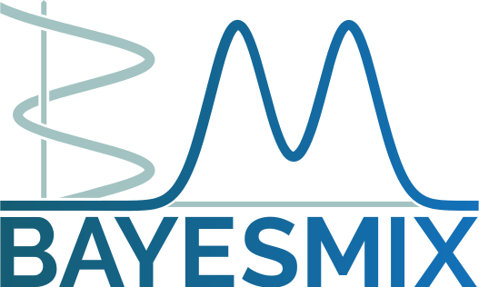

[](https://bayesmix.readthedocs.io/en/latest/?badge=latest)

`bayesmix` is a C++ library for running MCMC simulations in Bayesian mixture models.

Current state of the software:
- `bayesmix` performs inference for mixture models of the kind

<a href="https://www.codecogs.com/eqnedit.php?latex=y_1,&space;\ldots,&space;y_n&space;\sim&space;\int&space;k(\cdot&space;\mid&space;\theta)&space;P(d\theta)" target="_blank"></a>

<a href="https://www.codecogs.com/eqnedit.php?latex=P&space;\sim&space;\Pi" target="_blank"></a>

where P is either the Dirichlet process or the Pitman--Yor process

- We currently support univariate and multivariate location-scale mixture of Gaussian densities

- Inference is carried out using algorithms such as Algorithm 2 in [Neal (2000)](http://www.stat.columbia.edu/npbayes/papers/neal_sampling.pdf)

- Serialization of the MCMC chains is possible using Google's [Protocol Buffers](https://developers.google.com/protocol-buffers) aka `protobuf`


# Installation
## For end users
**Warning**: make sure you have a recent version of `cmake` installed (at least 3.20.x) or install `protobuf` beforehand (see the section for developers)!

To install and use `bayesmix`, please clone this repository with the following command-line instruction:
```shell
git clone --recurse-submodule git@github.com:bayesmix-dev/bayesmix.git
```

To build the executable for the main file `run.cc`, please use the following list of commands:
```shell
mkdir build
cd build
cmake .. -DDISABLE_DOCS=on -DDISABLE_BENCHMARKS=on -DDISABLE_TESTS=on
make run
cd ..
```

### Tutorial
The `build/run` executable can be used to perform all the necessary analysis, but it needs some command-line arguments to be passed.
To perform your first run of the library right out of the box, you can call the following script from the command line:
```shell
examples/tutorial/run.sh
```
This is an example script that runs said executable by passing appropriate arguments to it.
In order to use your custom datasets, algorithm settings, and prior specifications, you can create a copy of the above script and change the arguments as appropriate.
Please refer to the [documentation](#Documentation) for more information.


## For developers
We heavily depend on the `protobuf` library to move and store structured data.
The `CMakeLists.txt` file is set up to install such library if it does not find it in the computer.
However any call to `make clean` will uninstall it, causing a huge waste of time... so make sure to install it manually beforehand!
If you're using a Linux machine, you can do so as follows:
```shell
sudo apt-get install autoconf automake libtool curl make g++ unzip cmake
wget https://github.com/protocolbuffers/protobuf/releases/download/v3.14.0/protobuf-python-3.14.0.zip
unzip protobuf-python-3.14.0.zip
cd protobuf-3.14.0/
./configure --prefix=/usr
make check
sudo make install
sudo ldconfig
```
On Mac and Windows machines, please follow the steps from the [official `protobuf` installation guide](https://github.com/protocolbuffers/protobuf/blob/master/src/README.md).

Another very useful tool is [`ccache`](https://ccache.dev) that can significantly speed up the compilation process.

Finally, to compile unit tests, please use the following commands:
```shell
cd build
cmake ..
make test_bayesmix
cd ..
```
The corresponding executable is located at `build/test/test_bayesmix`.

# Documentation
Documentation is available at https://bayesmix.readthedocs.io.

# Contributions are welcome!
Please check out [CONTRIBUTORS.md](CONTRIBUTORS.md) for details on how to collaborate with us.
